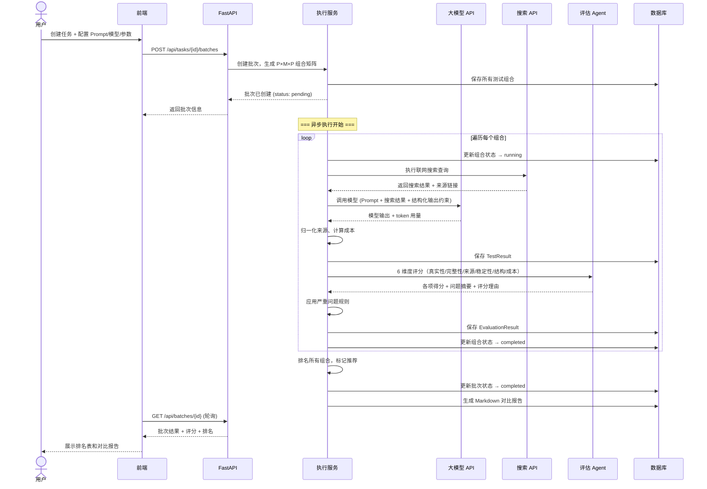

# 🤖 Agent Eval Platform

> A multi-agent web-search Agent configuration testing & optimization platform — test, evaluate, compare, and optimize your Agent's Prompt, model, and parameter combinations systematically.

[](https://www.python.org/downloads/)
[](https://fastapi.tiangolo.com/)
[](https://vuejs.org/)
[](LICENSE)

---

## 📖 Table of Contents

- [Overview](#-overview)
- [Why This Project](#-why-this-project)
- [Core Features](#-core-features)
- [Architecture](#-architecture)
- [Tech Stack](#-tech-stack)
- [Project Structure](#-project-structure)
- [Quick Start](#-quick-start)
- [Configuration](#-configuration)
- [API Reference](#-api-reference)
- [Multi-Agent System](#-multi-agent-system)
- [Evaluation System](#-evaluation-system)
- [Roadmap](#-roadmap)
- [Contributing](#-contributing)

---

## 🎯 Overview

**Agent Eval Platform** is an engineering-grade platform for testing and optimizing web-search-enabled AI Agents. Instead of guessing which Prompt, model, or parameter combination works best, you can now **systematically test, score, compare, and auto-optimize** your Agent configurations — all through an interactive web UI.

### The Core Problem

When building a web-search Agent, the same task can yield drastically different results depending on:

- Which **Prompt** template you use
- Which **LLM model** you call
- What **parameters** (temperature, search depth, etc.) you set
- How these factors **interact** with each other

Common LLM failures in web-search tasks include:

| Failure Mode | Example |
|---|---|
| 🕐 **Temporal hallucination** | Rewriting old info as breaking news |
| 🔮 **Prediction-as-fact** | Treating forecast data as confirmed events |
| 📝 **Fabrication** | Inventing conclusions without reliable sources |
| 🔗 **Source mismatch** | Citations that don't support the key claims |
| 📊 **False completeness** | Output looks thorough but misses critical info |
| 💸 **Cost inefficiency** | Expensive models with no quality improvement |

**This platform turns Agent debugging from "feeling-based trial-and-error" into a data-driven, repeatable engineering workflow.**

### What Can You Test?

- ✅ Multiple Prompt versions against the same task
- ✅ Multiple LLM models with identical Prompts
- ✅ Parameter sensitivity (temperature, search limits, etc.)
- ✅ Full combinatorial testing: **Prompt × Model × Parameters**
- ✅ Cost-vs-quality trade-offs across configurations

---

## ✨ Core Features

### Phase 1 — Test Loop (Current)

| Feature | Description |
|---|---|
| 🧪 **Task Creation** | Define web-search test tasks with focus points & background |
| 📝 **Prompt Management** | Add, edit, version, and compare multiple Prompt templates |
| 🤖 **Model Configuration** | Select from DeepSeek, Alibaba Bailian (Qwen), and more |
| ⚙️ **Parameter Tuning** | Configure temperature, top_p, search limits, structured output, etc. |
| 🔀 **Combination Generation** | Auto-generate `Prompt × Model × Parameters` test matrix |
| ▶️ **Batch Execution** | Run all combinations and capture raw output, sources, & cost |
| 📊 **Heuristic Scoring** | Multi-dimensional evaluation with configurable weights |
| 📄 **Report Generation** | Markdown comparison reports with rankings & recommendations |
| 🖥️ **Web Dashboard** | Full Vue 3 UI for task creation, monitoring, and result analysis |

### Phase 2 — Optimization Loop (In Progress)

| Feature | Description |
|---|---|
| 🔧 **Auto Prompt Optimization** | Diagnose failures → auto-generate improved Prompt versions |
| 🔄 **One-Click Re-Test** | Run optimized configs against originals in a new batch |
| 📈 **Before/After Comparison** | Side-by-side quality and cost comparison |
| 🧠 **Optimization Planner** | Multi-agent diagnosis → action plan → config generation |

### Key Differentiators

1. **Truthfulness-first evaluation** — writing quality never offsets factual errors
2. **Severe-problem rules** — hallucination, fabricated sources, and temporal errors trigger automatic score caps
3. **Cost tracking** — per-combination token usage × pricing table = real cost insight
4. **Source verification** — normalized source extraction and citation-to-claim matching
5. **Demo mode** — verify the full flow without API keys (clearly marked as mock)

---

## 🏗️ 系统架构

```mermaid
graph TB
    subgraph FRONTEND["🖥️ 前端展示层 — Vue 3 + TypeScript + Vite"]
        direction TB
        BROWSER["用户浏览器<br/>http://localhost:5173"]

        subgraph VUE_APP["Vue 3 单页应用"]
            direction LR
            ROUTER["路由管理<br/>Vue Router"]
            STORE["状态管理<br/>Pinia"]
            PAGES["页面组件<br/>Dashboard · 任务管理 · 流水线<br/>任务详情 · 模型库"]
        end

        COMPONENTS["通用组件<br/>SectionPanel · StatusBadge"]
        AXIOS["HTTP 客户端<br/>Axios · 38 个类型化 API 函数"]
    end

    subgraph BACKEND["⚙️ 后端应用层 — FastAPI + Python 3.12"]
        direction TB
        FASTAPI["FastAPI 服务器<br/>http://localhost:8000"]

        subgraph API_LAYER["REST API 路由层 (8 个模块)"]
            direction LR
            API_TASK["任务管理<br/>/api/tasks"]
            API_BATCH["批次执行<br/>/api/batches"]
            API_PIPE["智能流水线<br/>/api/pipeline"]
            API_REPORT["报告生成<br/>/api/reports"]
            API_OPT["一键优化<br/>/api/optimization"]
            API_MODEL["模型库<br/>/api/model-library"]
            API_CONFIG["配置管理<br/>/api/configs"]
            API_HEALTH["健康检查<br/>/api/health"]
        end

        subgraph SVC_LAYER["业务服务层 (14 个模块)"]
            direction LR
            SVC_CORE["核心服务<br/>execution · evaluator<br/>reporting · pipeline"]
            SVC_OPT["优化服务<br/>prompt_optimization<br/>optimization_planner"]
            SVC_RULES["规则引擎<br/>evaluation_rules<br/>recommendation"]
            SVC_UTIL["工具服务<br/>search_planning<br/>source_normalization<br/>output_contracts"]
        end

        subgraph DATA_LAYER["数据访问层"]
            direction LR
            PYDANTIC["Pydantic v2 校验<br/>50+ DTO 模型"]
            ORM["SQLAlchemy ORM<br/>14 张数据表映射"]
        end
    end

    subgraph AGENT["🧠 多智能体系统 — LangGraph 编排"]
        direction TB

        subgraph AGENT_LIST["7 个专用智能体"]
            direction LR
            AG1["流水线规划 Agent<br/>自然语言 → 测试方案<br/>模型: Qwen-Max"]
            AG2["任务执行 Agent<br/>调用 LLM + 搜索工具<br/>模型: Qwen-Plus"]
            AG3["评估 Agent<br/>6 维度打分<br/>模型: Qwen-Plus"]
            AG4["问题发现 Agent<br/>幻觉/时间错置检测<br/>模型: Qwen-Plus"]
            AG5["Prompt 优化 Agent<br/>诊断 → 生成改进版<br/>模型: Qwen-Plus"]
            AG6["优化方案 Agent<br/>汇总 → 行动计划<br/>模型: Qwen-Max"]
            AG7["报告生成 Agent<br/>Markdown 对比报告<br/>模型: Qwen-Plus"]
        end

        subgraph TOOL_LAYER["🔧 工具层（脚本化，非 LLM）"]
            direction LR
            T1["模型调用客户端<br/>ModelClient<br/>OpenAI 兼容 + 重试 + 成本记录"]
            T2["搜索客户端<br/>SearchClient<br/>Tavily / Serper 外部搜索"]
        end
    end

    subgraph EXTERNAL["🌐 外部服务"]
        direction LR
        LLM_API["LLM 平台 API<br/>DeepSeek · 阿里百炼(Qwen)<br/>OpenAI 兼容 Chat Completions"]
        SEARCH_API["搜索引擎 API<br/>百炼内置搜索（默认）<br/>Tavily · Serper（可选）"]
    end

    subgraph STORAGE["💾 数据与部署"]
        direction LR
        DB[("数据库<br/>MySQL 8.4 生产<br/>SQLite 开发")]
        DOCKER["Docker Compose<br/>MySQL :3306<br/>Backend :8000<br/>Frontend :5173"]
    end

    %% 数据流连接
    BROWSER --> VUE_APP
    VUE_APP --> AXIOS
    AXIOS -->|"HTTP REST 调用"| API_LAYER
    API_LAYER --> SVC_LAYER
    SVC_LAYER --> DATA_LAYER
    SVC_LAYER -->|"编排调用"| AGENT_LIST
    AGENT_LIST --> TOOL_LAYER
    TOOL_LAYER -->|"API 调用"| LLM_API
    TOOL_LAYER -->|"API 调用"| SEARCH_API
    DATA_LAYER --> DB
    DB -.-> DOCKER

    %% 样式
    style FRONTEND fill:#e8f5e9,stroke:#2e7d32,stroke-width:2px
    style BACKEND fill:#e3f2fd,stroke:#1565c0,stroke-width:2px
    style AGENT fill:#fff3e0,stroke:#e65100,stroke-width:2px
    style EXTERNAL fill:#fce4ec,stroke:#c62828,stroke-width:2px
    style STORAGE fill:#f3e5f5,stroke:#6a1b9a,stroke-width:2px
```



### 核心数据流

```
用户创建任务 → 添加 Prompt / 模型 / 参数配置 → 自动生成测试组合矩阵
                                                      ↓
┌────────────────────────── 批次异步执行 ──────────────────────────┐
│                                                                  │
│  ① 构建搜索计划 ──→ ② 执行联网搜索 ──→ ③ 调用 LLM 生成结果       │
│                                      ↓                          │
│  ⑥ 应用严重问题规则 ←── ⑤ 评估 Agent 打分 ←── ④ 提取并归一化来源  │
│         ↓                                                        │
│  ⑦ 保存评分结果 ──→ ⑧ 标记推荐组合 ──→ ⑨ 生成对比报告            │
│                                                                  │
└──────────────────────────────────────────────────────────────────┘
                                                      ↓
用户查看报告 ──→ [一键优化] ──→ 自动生成新版 Prompt/参数 ──→ 新一轮测试
```

### 智能体协作流程



---

## 🛠️ Tech Stack

| Layer | Technology | Purpose |
|---|---|---|
| **Frontend** | Vue 3, TypeScript, Vite | Reactive SPA with type safety |
| | Vue Router, Pinia | Client-side routing & state management |
| | Axios | HTTP client for API calls |
| **Backend** | FastAPI 0.115 | Async REST API with auto OpenAPI docs |
| | Pydantic v2 | Request/response validation & serialization |
| | SQLAlchemy 2.0 | ORM with async support |
| | LangGraph 0.2 | Multi-agent workflow orchestration |
| **Database** | MySQL 8.4 (production) / SQLite (dev) | Persistent storage |
| **LLM Providers** | DeepSeek, Alibaba Bailian (Qwen) | OpenAI-compatible Chat Completions |
| **Search** | Bailian built-in search, Tavily, Serper | Web search tool backends |
| **DevOps** | Docker Compose | One-command full-stack deployment |

---

## 📁 Project Structure

```
eval_LLM/
├── backend/                        # FastAPI backend
│   ├── app/
│   │   ├── agents/                 # Agent system prompts & graph definitions
│   │   │   ├── graph.py                    # LangGraph workflow orchestration
│   │   │   ├── evaluation_prompts.py       # Evaluator agent prompts
│   │   │   ├── pipeline_prompts.py         # Pipeline planner prompts
│   │   │   ├── prompt_optimization_prompts.py  # Optimizer agent prompts
│   │   │   └── optimization_planner_prompts.py # Planner agent prompts
│   │   ├── api/                    # REST API layer
│   │   │   ├── router.py                   # API route aggregation
│   │   │   └── routes/                     # Route handlers
│   │   │       ├── tasks.py                # CRUD for test tasks
│   │   │       ├── batches.py              # Batch execution management
│   │   │       ├── pipeline.py             # Smart pipeline generation
│   │   │       ├── reports.py              # Report generation & retrieval
│   │   │       ├── model_library.py        # Model profile management
│   │   │       ├── optimization.py         # One-click optimization
│   │   │       ├── configs.py              # Prompt/model/param configs
│   │   │       └── health.py               # Health check endpoint
│   │   ├── core/                   # Core configuration & adapters
│   │   │   ├── config.py                   # App settings (env vars)
│   │   │   ├── model_adapters.py           # Multi-provider LLM adapter
│   │   │   └── pricing.py                  # Cost calculation engine
│   │   ├── db/                     # Database
│   │   │   └── session.py                  # SQLAlchemy session & init
│   │   ├── models/                 # ORM entities
│   │   │   └── entities.py                 # All database models
│   │   ├── schemas/                # Pydantic DTOs
│   │   │   └── dto.py                      # Request/response schemas
│   │   ├── services/               # Business logic
│   │   │   ├── crud.py                     # Generic CRUD operations
│   │   │   ├── execution.py                # Batch execution orchestrator
│   │   │   ├── evaluator.py                # Multi-dimension scoring
│   │   │   ├── evaluation_rules.py         # Severe-problem rule engine
│   │   │   ├── reporting.py                # Markdown report generation
│   │   │   ├── pipeline.py                 # Smart planning & auto-generation
│   │   │   ├── recommendation.py           # Best-config ranking algorithm
│   │   │   ├── prompt_optimization.py      # Prompt auto-improvement
│   │   │   ├── optimization_planner.py     # Optimization action planner
│   │   │   ├── model_library.py            # Model profile management
│   │   │   ├── search_planning.py          # Search strategy planning
│   │   │   ├── source_normalization.py     # Source URL extraction & normalization
│   │   │   ├── output_contracts.py         # Structured output formats
│   │   │   └── defaults.py                 # Default evaluation configs
│   │   ├── tools/                  # External service clients
│   │   │   ├── model_client.py             # Unified LLM API client
│   │   │   └── search_client.py            # Unified search API client
│   │   └── main.py                 # FastAPI app entry point
│   ├── scripts/
│   │   └── migrate_models_to_db.py         # DB migration script
│   ├── requirements.txt
│   └── Dockerfile
├── frontend/                       # Vue 3 frontend
│   ├── src/
│   │   ├── api/                    # API client layer
│   │   │   ├── client.ts                   # Axios instance configuration
│   │   │   └── platform.ts                 # Typed API functions
│   │   ├── components/             # Shared UI components
│   │   │   ├── SectionPanel.vue             # Collapsible section wrapper
│   │   │   └── StatusBadge.vue             # Status indicator component
│   │   ├── layouts/
│   │   │   └── AppLayout.vue               # Main application layout
│   │   ├── router/
│   │   │   └── index.ts                    # Vue Router configuration
│   │   ├── types/
│   │   │   └── index.ts                    # TypeScript type definitions
│   │   ├── utils/
│   │   │   └── format.ts                   # Formatting utilities
│   │   ├── views/                  # Page-level components
│   │   │   ├── DashboardView.vue           # Home dashboard
│   │   │   ├── TasksView.vue               # Task list
│   │   │   ├── TaskCreateView.vue          # Task creation wizard
│   │   │   ├── TaskDetailView.vue          # Task detail & config management
│   │   │   ├── TaskPipelineView.vue        # Smart pipeline generation
│   │   │   └── ModelLibraryView.vue        # Model profile library
│   │   ├── App.vue                 # Root component
│   │   ├── main.ts                 # Vue app entry point
│   │   ├── styles.css              # Global styles
│   │   └── env.d.ts                # Environment type declarations
│   ├── package.json
│   └── Dockerfile
├── config/                         # Centralized configuration
│   ├── model_adapters.json         # LLM provider & agent model assignments
│   └── pricing.json                # Model & tool pricing tables
├── classifier/                     # Experimental: text classification eval
├── plans/                          # Development planning documents
├── docker-compose.yml              # Full-stack Docker deployment
├── requirements.txt                # Root dependencies (delegates to backend/)
├── .gitignore
├── AGENTS.md                       # Coding assistant guidance
└── README.md                       # This file
```

---

## 🚀 Quick Start

### Prerequisites

- **Python** 3.12+
- **Node.js** 18+
- **MySQL** 8.4 (optional; SQLite is used for local dev)

### Local Development

#### 1. Clone & Setup Backend

```bash
git clone <your-repo-url>
cd eval_LLM

# Backend setup
cd backend
cp .env.example .env          # Edit .env with your API keys
python -m venv .venv
.venv\Scripts\activate         # Windows
# source .venv/bin/activate    # macOS/Linux
pip install -r requirements.txt
uvicorn app.main:app --reload
```

Backend runs at **http://localhost:8000**
- API docs: http://localhost:8000/docs
- Health check: http://localhost:8000/api/health

#### 2. Setup Frontend

```bash
cd frontend
cp .env.example .env
npm install
npm run dev
```

Frontend runs at **http://localhost:5173**

#### 3. Configure API Keys

Edit `backend/.env`:

```env
# LLM Provider API Keys
DEEPSEEK_API_KEY=sk-your-deepseek-key
BAILIAN_API_KEY=sk-your-bailian-key

# Database (SQLite by default for local dev)
DATABASE_URL=sqlite:///./agent_eval.db

# Optional: External search providers
# SEARCH_PROVIDER=tavily
# TAVILY_API_KEY=tvly-your-key
```

Agent-model assignments are in `config/model_adapters.json`. Each agent (executor, evaluator, optimizer, etc.) can use a different provider and model.

### Docker Compose (Full Stack)

```bash
cp backend\.env.example backend\.env   # Edit with your API keys
docker compose up --build
```

This starts MySQL 8.4, the FastAPI backend, and the Vue frontend together.

---

## ⚙️ Configuration

### Model Adapters (`config/model_adapters.json`)

Defines available LLM providers and per-agent model assignments:

```json
{
  "providers": {
    "deepseek": {
      "label": "DeepSeek",
      "api_style": "openai_compatible",
      "base_url": "https://api.deepseek.com",
      "default_model": "deepseek-v4-flash"
    },
    "bailian": {
      "label": "阿里百炼",
      "builtin_search": { "enabled": true }
    }
  },
  "agents": {
    "task_executor": { "provider": "bailian", "model": "qwen3.7-plus" },
    "evaluator":     { "provider": "bailian", "model": "qwen3.7-plus" },
    "reporter":      { "provider": "bailian", "model": "qwen3.7-plus" }
  }
}
```

**Supported search modes:**
- `bailian_builtin` (default) — Bailian's built-in web search via Chat Completions
- `tavily` / `serper` — External search APIs (requires respective API keys)

### Pricing (`config/pricing.json`)

Per-model and per-tool pricing configuration for cost tracking:

```json
{
  "currency": "CNY",
  "providers": {
    "bailian": {
      "models": {
        "qwen3.7-plus": {
          "input_per_million_tokens": 1,
          "output_per_million_tokens": 4
        }
      },
      "tools": {
        "web_search_per_1000_calls": 4
      }
    }
  }
}
```

### Evaluation Weights

Default scoring weights (configurable per task):

| Dimension | Weight | Description |
|---|---|---|
| **Truthfulness** | 50 | Factual accuracy, absence of hallucination |
| **Completeness** | 20 | Coverage of all required information |
| **Source Quality** | 10 | Reliability and relevance of cited sources |
| **Stability** | 10 | Consistency across multiple runs |
| **Structure & Clarity** | 5 | Output organization and readability |
| **Cost Efficiency** | 5 | Cost-to-quality ratio |

> **Truthfulness is the non-negotiable first principle.** Beautiful writing never compensates for factual errors.

---

## 📡 API Reference

Full interactive API docs are available at `http://localhost:8000/docs` when the backend is running.

### Key Endpoints

| Method | Endpoint | Description |
|---|---|---|
| `GET` | `/api/health` | Health check |
| `POST` | `/api/tasks` | Create a test task |
| `GET` | `/api/tasks` | List all tasks |
| `GET` | `/api/tasks/{id}` | Get task detail |
| `POST` | `/api/tasks/{id}/prompts` | Add a Prompt |
| `POST` | `/api/tasks/{id}/model-configs` | Add a model config |
| `POST` | `/api/tasks/{id}/parameter-configs` | Add a parameter config |
| `POST` | `/api/tasks/{id}/batches` | Create & run a test batch |
| `GET` | `/api/batches/{id}` | Get batch status & results |
| `GET` | `/api/reports/{id}` | Get evaluation report |
| `POST` | `/api/pipeline/draft` | Generate smart test plan from requirement |
| `POST` | `/api/pipeline/commit` | Commit generated plan as task |
| `POST` | `/api/optimization/plan` | Generate optimization plan |
| `POST` | `/api/optimization/execute/{plan_id}` | Execute optimization |
| `GET` | `/api/model-library/models` | List model profiles |
| `GET` | `/api/model-library/models/{id}/stats` | Model performance statistics |

---

## 🧠 Multi-Agent System

The platform uses **LangGraph** to orchestrate a team of specialized LLM agents:

| Agent | Role | Key Responsibilities |
|---|---|---|
| **Pipeline Planner** | Task analysis & planning | Parse user requirements → generate test plan with Prompts, models, & parameters |
| **Task Executor** | Test execution | Call LLM + search tools, capture outputs, sources, token usage & cost |
| **Evaluator** | Quality scoring | Score outputs across 6 dimensions with detailed rationale |
| **Problem Finder** | Issue diagnosis | Identify hallucinations, temporal errors, source mismatches, omissions |
| **Prompt Optimizer** | Configuration improvement | Diagnose failure patterns → generate improved Prompt versions |
| **Optimization Planner** | Action planning | Synthesize evaluation results → structured optimization action plan |
| **Reporter** | Report generation | Compile results → ranked Markdown comparison report |

### Design Principle: Agent + Tool Hybrid

- **LLM Agents** handle semantic tasks: quality judgment, failure attribution, optimization design
- **Scripted Tools** handle deterministic tasks: cost calculation, parameter combination generation, source URL extraction, format validation

This hybrid design ensures both the flexibility of LLM reasoning and the reliability of engineering automation.

---

## 📊 Evaluation System

### Scoring Pipeline

```
Raw LLM Output
  → Source Normalization (extract & validate URLs)
  → Multi-Dimension Scoring (6 axes with configurable weights)
  → Severe-Problem Rules (automatic score caps for critical failures)
  → Problem Diagnosis (specific issue identification)
  → Final Score + Risk Level + Recommendation
```

### Severe-Problem Rules

Critical failures automatically cap the total score, regardless of other dimensions:

| Problem | Consequence |
|---|---|
| **Clear hallucination** (≥1 instance) | Minimum 40-point deduction |
| **Fabricated sources** or **unsupported key claims** | Total score capped at 40 |
| **Temporal misrepresentation** (old info → "latest") | Total score capped at 60 |
| **Prediction reported as fact** | Total score capped at 60 |
| **Key conclusions lack source support** | Total score capped at 70 |

---

## 🗺️ Roadmap

| Phase | Focus | Status |
|---|---|---|
| **Phase 1** | Core test loop: task → execute → evaluate → report | ✅ Done |
| **Phase 2** | Prompt optimization loop: diagnose → optimize → re-test | 🔄 In Progress |
| **Phase 3** | Advanced combinatorial testing: full matrix with ranking | 📋 Planned |
| **Phase 4** | Engineering hardening: async tasks (Celery), Redis cache, enhanced persistence | 📋 Planned |
| **Phase 5** | Task type expansion: document analysis, code debugging, writing assistance Agents | 📋 Planned |

---

## 🤝 Contributing

Contributions are welcome! Here's how to get started:

1. **Fork** the repository
2. **Create a branch** for your feature: `git checkout -b feature/amazing-feature`
3. **Make your changes** following the existing code style
4. **Test** your changes locally
5. **Commit** with a descriptive message
6. **Push** and open a **Pull Request**

### Code Style

- **Backend**: Follow PEP 8; use type hints; keep service logic in `services/`, not in route handlers
- **Frontend**: Use TypeScript strict mode; follow Vue 3 Composition API patterns; keep API calls in `api/`
- **Config**: Data files only in `config/`; no hardcoded values in source

### Development Notes

- For local dev without MySQL, keep `DATABASE_URL=sqlite:///./agent_eval.db` in `backend/.env`
- The platform works in **demo mode** without API keys (results are clearly marked as mock)
- Conda users: the project expects a conda environment named `eval`

---

## 📄 License

This project is licensed under the MIT License — see the [LICENSE](LICENSE) file for details.

---

## 🙏 Acknowledgements

- **LangGraph** — Multi-agent workflow orchestration framework
- **FastAPI** — High-performance Python web framework
- **Vue.js** — Progressive JavaScript framework
- **DeepSeek** & **Alibaba Bailian (Qwen)** — LLM API providers
- **Tavily** & **Serper** — Web search APIs

---

*Built with ❤️ for the Agent engineering community. Turn Agent debugging from art into engineering.*
